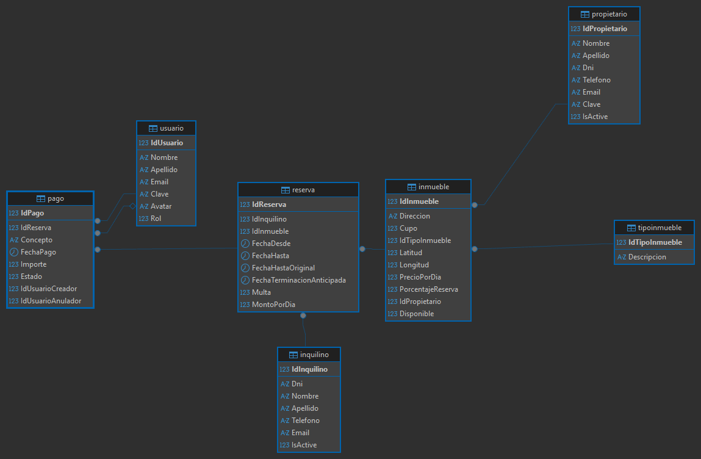

# Innova.
> El sistema trata de la informatización de la gestión de alquileres
>temporarios de propiedades inmuebles que realiza una agencia
>inmobiliaria.
.
---
# 👥 Integrantes del Grupo
* **Lucas Zarate** - *maxolucas@gmail.com* - [@Maxorgz](https://github.com/Maxorgz) - Discord: `maxy_1604`
* **Juan Genero** - *juanignaciogenero@gmail.com* - [@Juani-ds](https://github.com/Juani-ds) - Discord: `juanistratos`
* **Daniel Rodriguez** - *danielrodriguez45b@gmail.com* - [@Danirodriguez45B](https://github.com/Danirodriguez45B) - Discord: `dani45gsr`
---
## 📐 Modelado de Datos
A continuación se presenta el esquema del modelo de datos correspondiente a la aplicación:
## Diagrama Entidad-Relación (DER) / Diagrama de Clases

## ⚙️ Instrucciones claras para levantar la base de datos a partir del archivo .sql
Apartir del Script.sql dentro de la carpeta Data (./data/Script.sql).
Si llegase a haber algun problema con la coneccion de la BD respecto a las vistas y el nombre de tu ordenador, colocar el siguiente script: 

GRANT ALL PRIVILEGES ON *.* TO 'root'@'%' IDENTIFIED BY 'TU_CLAVE_AQUI';
FLUSH PRIVILEGES;

## 🚀 Guia de instalacion y ejecucion
Clonar el proyecto desde la terminal git clone https://github.com/Maxorgz/inmobiliariaGrupo22ULP o Bien desde la Git Desktop.
Ejecutar el comando en la terminal "dotnet add package MySqlConnector" para habilitar el conector SQL.
Antes de ejecutar el dotnet run, asegurarse de tener la base de datos lista. una ves lista Ejecutar el comando en la terminal "dotnet run", esto compilara el proyecto y en la parte de NOW LISTENING ON: mantener presionado Ctrl y click en http://localhost: ---- .

